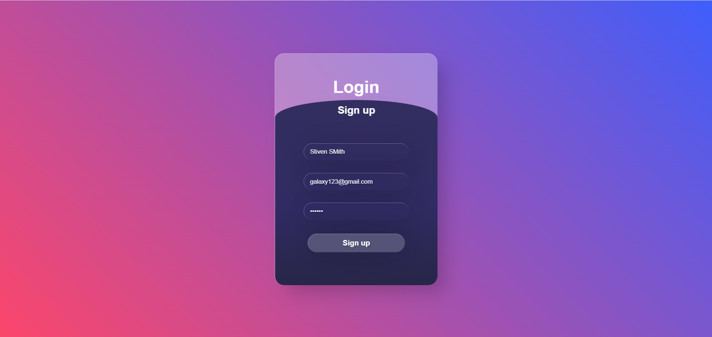
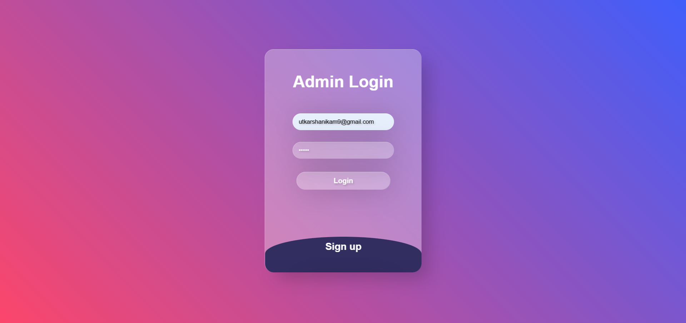
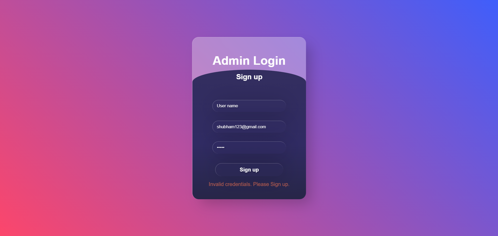
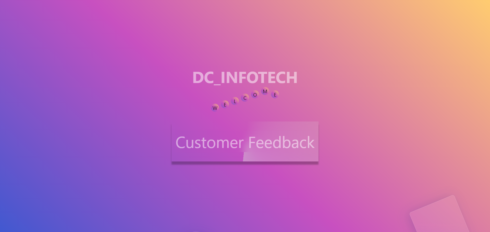
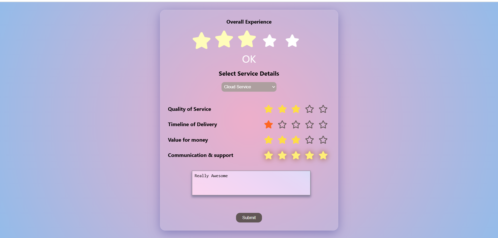
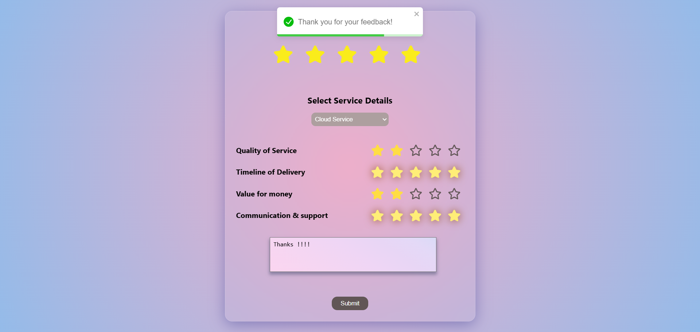
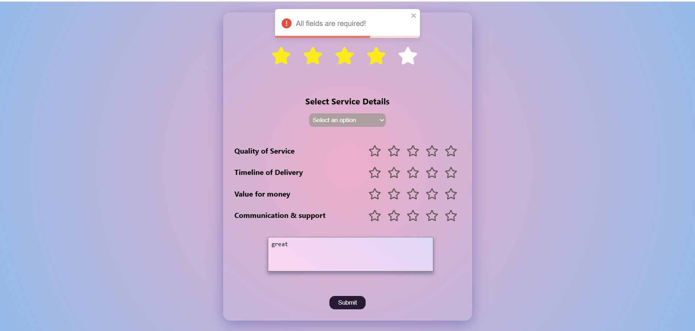
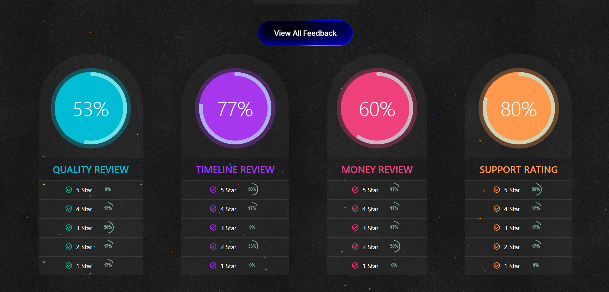
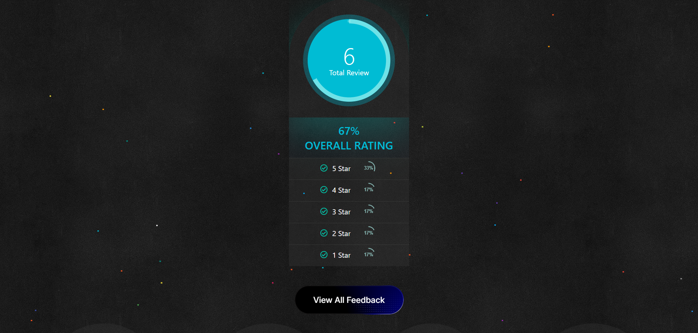

# Client Feedback Management Portal
## Overview
The **Client Feedback Management Portal** is a web-based system designed to streamline and manage feedback from clients efficiently. The system enables clients to provide feedback on IT services, while administrators can review and analyze this feedback to enhance service quality.

## Screenshots
### Login Page





### Client Dashboard






### Admin Panel



## Features
- **Unified Login System**: A single authentication system for both admins and users.   
- **Client Feedback Submission**: Clients can submit feedback on services received.
- **Admin Panel**: Admins can review, analyze, and respond to feedback.
- **Secure Authentication**: Uses JWT (JSON Web Tokens) for secure login.
- **Database Integration**: Stores user and feedback data securely using MongoDB.
- **Real-time Updates**: Provides live updates on submitted feedback.
- **Responsive Design**: Ensures accessibility across all devices.

## Unified Login System
The system implements a **unified login mechanism**, allowing both **clients and administrators** to log in using a single authentication process. Based on their role (client or admin), users are redirected to their respective dashboards:
- **Clients**: Can submit and track feedback.
- **Admins**: Can view all feedback, analyze trends, and take necessary actions.

## Tech Stack
- **Frontend**: React.js
- **Backend**: Express.js with Node.js
- **Database**: MongoDB
- **Authentication**: JWT for token-based authentication
- **Styling**: Tailwind CSS

## Folder Structure
```
Client-Feedback-Management/
│── client/   # Frontend (React.js)
│── admin/    # Admin panel
│── server/   # Backend (Express.js, MongoDB)
│── README.md # Documentation
```

## Installation & Setup
1. Clone the repository:
   ```sh
   git clone https://github.com/your-repo.git
   cd Client-Feedback-Management
   ```

2. Install dependencies for client, admin, and server:
   ```sh
   cd client
   npm install
   cd ../admin
   npm install
   cd ../server
   npm install
   ```

3. Set up environment variables in a `.env` file inside the `server/` folder:
   ```env
   MONGO_URI=your-mongodb-connection-string
   JWT_SECRET=your-secret-key
   ```

4. Start the server:
   ```sh
   cd server
   npm start
   ```

5. Start the frontend (client and admin):
   ```sh
   cd client
   npm start
   cd ../admin
   npm start
   ```

## API Endpoints
  | Method | Endpoint              | Description                   |
  |--------|-----------------------|-------------------------------|
  | POST   | `/api/auth/`loginUser | Login for clients and admins  |
  | POST   | `/api/auth/createUser`| Register a new client        |
  | GET    | `/api/details`        | Retrieve all feedback (admin) |
  | POST   | `/api/submitForm`     | Submit feedback (client)      |


## Contribution
Contributions are welcome! Feel free to open an issue or submit a pull request.

## License
MIT License

## Contact
For any inquiries, contact [your email] or visit [your website].
